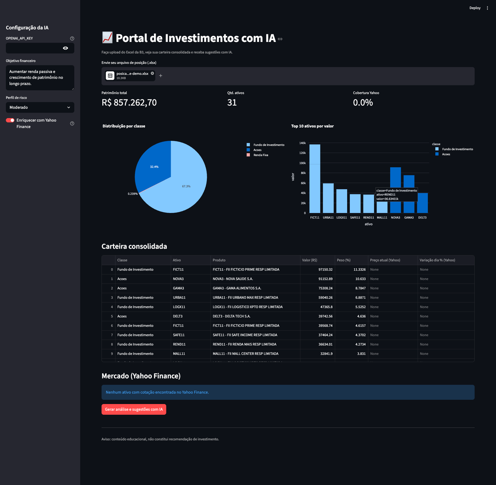

# B3 Portfolio AI Dashboard

Portal web para upload de extratos `.xlsx` da B3, consolidação da carteira, enriquecimento com dados de mercado e geração de insights com IA.

## Preview

<p align="center">
  
</p>

## Funcionalidades

- Upload de arquivo `.xlsx` de posição da B3
- Consolidação por classe de ativo e por ticker
- Indicadores de carteira (patrimônio, concentração e top posições)
- Gráficos interativos de alocação e top ativos
- Integração com Yahoo Finance para preço atual e variação diária
- Cobertura de cotações por ativo e seção de mercado (top altas e baixas)
- Sugestões com IA (ou fallback por regras, sem API key)

## Tecnologias

- Python
- Streamlit
- Pandas + OpenPyXL
- Plotly
- Yahoo Finance (`yfinance`)
- OpenAI API (opcional)

## Requisitos

- Python 3.11+

## Como executar localmente

```bash
python3 -m venv .venv
source .venv/bin/activate
pip install -r requirements.txt
streamlit run app.py
```

## Configuração de IA (opcional)

- No menu lateral da aplicação, preencha `OPENAI_API_KEY` para análise por LLM.
- Sem chave, o sistema usa análise automática por regras.

## Dados de mercado com Yahoo Finance

- Por padrão, o app tenta enriquecer ações e FIIs com dados do Yahoo Finance.
- Caso um ticker não seja encontrado, o app continua funcionando e exibe cobertura parcial.
- A busca usa cache para reduzir latência e chamadas repetidas.

## Estrutura do projeto

- `app.py`: aplicação principal
- `requirements.txt`: dependências
- `README.md`: documentação

## Sugestão de publicação no GitHub

- Nome de repositório recomendado: `b3-portfolio-ai-dashboard`
- Descrição curta (About): `Dashboard de investimentos com upload de extrato B3, cotações Yahoo Finance e insights com IA.`
- Tópicos (tags): `python`, `streamlit`, `investments`, `b3`, `yfinance`, `openai`, `portfolio`, `fintech`

## Aviso importante

Este projeto tem finalidade educacional e não constitui recomendação de investimento.

## Privacidade

Não publique arquivos reais de posição/movimentação que contenham dados pessoais.
